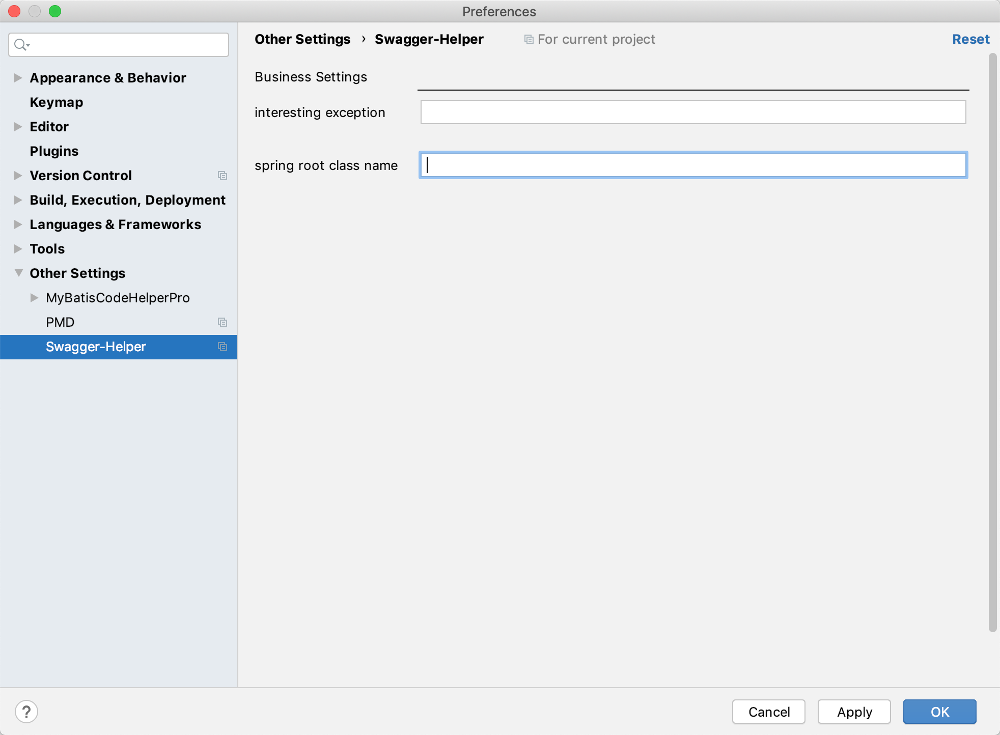

# READEME

## 使用方法
1. 安装插件
2. 选中类名或方法名 -> generate code(Command + N or alt + insert) -> generate swagger annotation 

目前已知最低兼容版本为2019.3。5

## 注解支持

1. ApiImplicitParam:
    - value: 默认为空字符串
    - name： 默认为变量名
    - required： 默认为true
    - paramType:
        - body
            - RequestBody: 
                1. 基础类型：不生成注解
                2. 复合类型：生成注解，dataType：类名，dataTypeClass：全限定类名.class
        - query
            - RequestParam:
                1. 基础类型：生成注解，dataType：类名，dataTypeClass：全限定类名.class
                2. 复合类型：不生成注解
        - path
            - PathVariable:
                1. 基础类型：生成注解，dataType：类名，dataTypeClass：全限定类名.class
                2. 复合类型：不生成注解
        - header
            - RequestHeader:
                1. 基础类型：生成注解，dataType：类名，dataTypeClass：全限定类名.class
                2. 复合类型：不生成注解
                
2. ApiOperation:
    - httpMethod: 基于RequestMapping\GetMapping\DeleteMapping\PostMapping\PutMapping生成
    - value：暂时为空字符串
    - notes：暂时为空字符串
    
3. Api:
    - value: 空字符串
    - description：空字符串

4. ApiModel
    - value: 类名
    - description： 读注解
5. ApiModelProperty:
    - value: 读取注解
    - required：true
6. ApiResponse
    
    Swagger-Helper支持根据异常以及状态码，生成ApiResponse注解。使用该功能需要满足如下条件：
    1. 状态码需使用异常抛出的方式处理。例如使用Spring MVC 的统一异常处理，抛出异常，使用Spring MVC支持将异常转化为code、message，例如：
        ```java
       BusinessException
        ```
       使用ExceptionHandler拦截BusinessException进行处理。
    2. code、message需通过枚举标注。例如：
        ```java
        public enum ErrorCode {
            SUCCESSFUL(0,"Successfully");
            int code;
            
            int message;
            
            public ErrorCode(int code, int message) {
                this.code  = code;
                this.message = message;
            }
        }      
        ```
       抛出异常时需将对应的ErrorCode作为构造参数传入，例如：
       ```java
        throw new BusinessException(ErrorCode.SUCCESSFUL);
        ```
       此时如果Swagger-Helper检测到上面的异常抛出语句，会生成@ApiResponse(code=0,message="Successfully")注解。
       
       事实上，Swagger-Helper检测到Exception的构造参数中，只要有符合上述ErrorCode特征注解，就会自动扫描，因此，如果上面的异常抛出语句是如下形式，也是没有问题的：
       
       ```java
       throw new BusinessException(ErrorCode.SUCCESSFUL, "Message");
       throw new BusinessException(ErrorCode.SUCCESSFUL, 1.0);
       ```
       
        对于抛出的Exception，可在Preferences-> Other settings ->Swagger-Helper -> interesting exception配置项中进行配置。
        
        
        
        如有多个Exception需要检测，请以`分号`分隔
        
        如果需要Spring容器支持，您需要在Preferences-> Other settings ->Swagger-Helper -> spring root class name配置项中配置您的SpringBoot项目启动类的全类名，以便Swagger-Helper分析Spring容器中的bean。
        
        欢迎使用者提出Issue，完善该工具。
